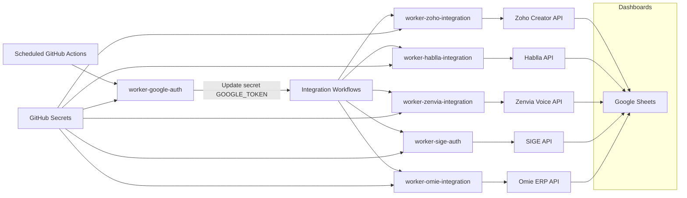
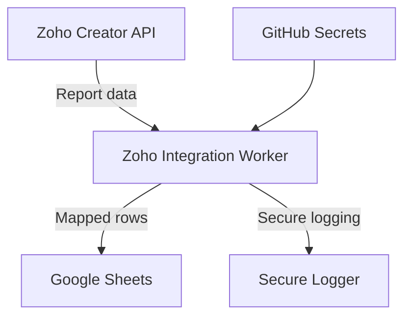
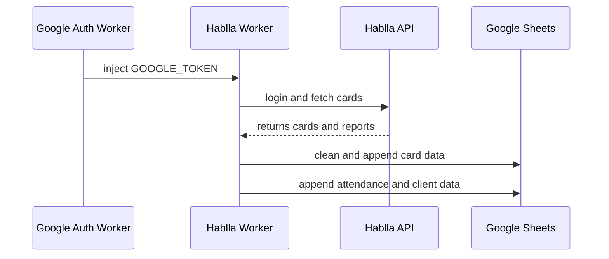
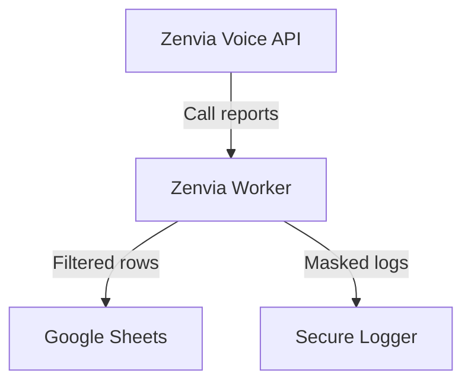
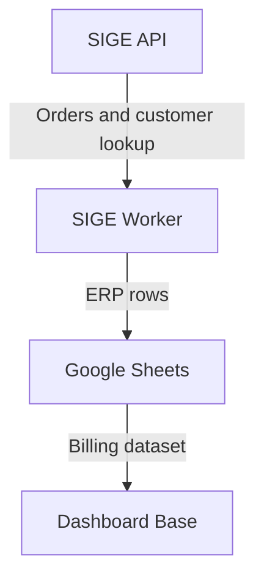
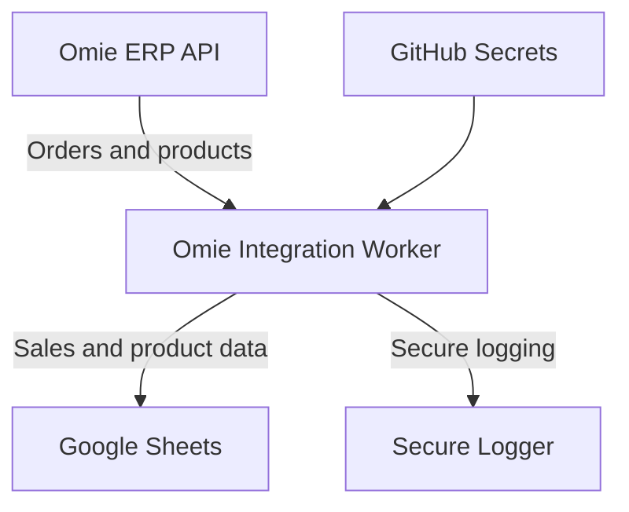
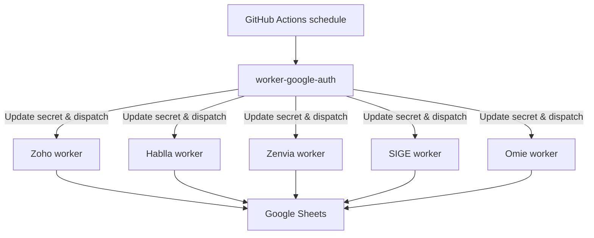

# API Integration Hub

This is a central hub for API worker projects designed to extract, process, and synchronize data into Google Sheets. Each worker is implemented with secure credential handling, GitHub Actions orchestration, and daily scheduling for downstream dashboard and analytics use cases.

## Navigation

- [Overview](#overview)
- [System Architecture](#system-architecture)
- [Worker Summaries](#worker-summaries)
  - [Google Auth Worker](#google-auth-worker)
  - [Zoho Integration Worker](#zoho-integration-worker)
  - [Hablla Integration Worker](#hablla-integration-worker)
  - [Zenvia Integration Worker](#zenvia-integration-worker)
  - [SIGE Integration Worker](#sige-integration-worker)
  - [Omie Integration Worker](#omie-integration-worker)
- [Security and Data Handling](#security-and-data-handling)
- [Daily Execution Flow](#daily-execution-flow)
- [Usage Guide](#usage-guide)
- [Repository References](#repository-references)

## Overview

This hub combines public API integration workers sourced from GitHub. The goal is to provide a consolidated reference for:

- automated daily token orchestration
- API-specific extraction and processing logic
- secure secret management via GitHub Actions
- data synchronization into Google Sheets
- support for downstream dashboard consumption and analytics

Each worker is implemented as an independent repository, with specific endpoints, token handling, and rate-limit controls.

## System Architecture

## Worker Summaries

### Google Auth Worker

- Repository: https://github.com/operacoesicaiu/worker-google-auth
- Local path: `./worker-google-auth-main/worker-google-auth-main`

The Google Auth worker is the orchestration entry point for this hub. It creates a Google OAuth access token from a service account, encrypts that token, updates destination repository secrets, and triggers repository dispatch events.

#### Core behavior

- Generates a JWT signed with `GOOGLE_PRIVATE_KEY`
- Exchanges the JWT for a Google OAuth access token
- Retrieves the destination repository public key from GitHub
- Encrypts `GOOGLE_TOKEN` using GitHub secret encryption flow
- Sends repository dispatch events to target workers
- Uses `GH_PAT` to update secrets and dispatch workflows

#### Workflow details

- Triggered daily at `06:00 AM Brasília` via GitHub Actions (`cron: '0 9 * * *'`)
- Runs sequential dispatches to:
  - `operacoesicaiu/worker-zoho-integration`
  - `operacoesicaiu/worker-zenvia-integration`
  - `operacoesicaiu/worker-hablla-integration`
  - `operacoesicaiu/worker-sige-auth`
  - `operacoesicaiu/worker-omie-integration`
- Supports manual override via `REPO_MANUAL`

#### Security and token handling

- Uses a service account `GOOGLE_CLIENT_EMAIL` and `GOOGLE_PRIVATE_KEY`
- Keeps token generation off-line inside the worker environment
- Only stores the generated access token in GitHub Actions secret `GOOGLE_TOKEN`
- Does not expose raw sensitive values in logs

#### Limitations

- Token lifetime is limited by Google OAuth (one hour)
- The worker refreshes tokens before dispatch, so downstream workers rely on the latest valid token
- GitHub PAT permissions must include `actions: write` and repository dispatch access

### Zoho Integration Worker

- Repository: https://github.com/operacoesicaiu/worker-zoho-integration
- Local path: `./worker-zoho-integration-main/worker-zoho-integration-main`

This worker authenticates with Zoho Creator, retrieves records from a configured report, and appends mapped data to Google Sheets.

#### Core behavior

- Authenticates via Zoho OAuth refresh token
- Constructs Zoho Creator criteria for yesterday
- Uses paginated fetches with `from` and `limit` parameters
- Applies field mapping from `COLUMN_MAPPING`
- Sanitizes values to prevent spreadsheet formula injection
- Writes batched rows to Google Sheets via API

#### Workflow

- Triggered by `repository_dispatch` event type `google_token_ready`
- Runs the default `index.js` process
- Requires Node.js 20 and installs `axios`

#### Security and data handling

- Sensitive credentials are stored in GitHub Secrets
- The worker uses `ZOHO_REFRESH_TOKEN`, `ZOHO_CLIENT_ID`, and `ZOHO_CLIENT_SECRET`
- `GOOGLE_TOKEN` is injected from the Google Auth worker
- Field values are sanitized using a `sanitize()` helper that prefixes dangerous strings
- The worker uses `extractValue()` to normalize Zoho lookup fields, arrays, and nested objects

#### Rate limiting and performance

- Uses a 1.5-second pause between Google Sheets batches
- Requests Zoho Creator pages of 200 records
- Stops when no more records are returned or list length is below limit

#### Limitations

- Dependent on Zoho Creator API response format and field names
- Field mapping must be kept in sync with Zoho report schema
- The worker does not currently refresh the Google token itself; it relies on the injected `GOOGLE_TOKEN`

### Zoho Report Sync Worker

- Additional worker file: `report-sync.js`
- Local path: `./worker-zoho-integration-main/worker-zoho-integration-main/report-sync.js`

This secondary Zoho worker synchronizes a larger report dataset and merges it into a Google Sheet while preserving historical rows from the current period.

#### Core behavior

- Authenticates with Zoho via refresh token
- Loads up to 10,000 records using paginated requests
- Waits 3 minutes before execution to reduce simultaneous API contention
- Reads metadata and existing row dates from the target sheet
- Deletes rows for the current import window before appending new rows
- Uses a dictionary sheet for value normalization
- Performs data corrections for date, phone, and formula-safe formatting

#### Limitations

- Designed for multi-month period sync, not for real-time ingestion
- Depends on existing sheet layout and a `Dicionário` sheet
- May require schema updates if Zoho report fields change

### Hablla Integration Worker

- Repository: https://github.com/operacoesicaiu/worker-hablla-integration

This worker fetches Hablla cards, attendance summaries, and client records, then pushes them into Google Sheets with cleanup and duplicate removal.

#### Core behavior

- Authenticates to Hablla API using email/password
- Uses a 500ms delay between Hablla requests to avoid rate limits
- Retrieves cards updated in the last seven days
- Appends processed card rows to sheet `Base Hablla Card`
- Removes duplicate rows based on card ID
- Generates attendance summary rows for `Base Atendente`
- Loads new clients created in the previous day into `Base Cliente`

#### Data handling and processing

- Converts dates into Brazilian format
- Extracts custom fields from Hablla cards using fixed field IDs
- Sanitizes all free-text fields for Google Sheets
- Collapses tags into comma-separated strings
- Supports client phone, email, sectors, tags, and custom field consolidation

#### Workflow

- Triggered by `repository_dispatch` event type `google_token_ready`
- Requires `GOOGLE_TOKEN` plus Hablla secrets
- Uses the Google Sheets v4 API directly for metadata and batch updates

#### Security and limitations

- Sensitive secrets are stored in GitHub Secrets
- Does not publish any access token values to logs
- Relies on the target sheet containing named tabs: `Base Hablla Card`, `Base Atendente`, and optionally `Base Cliente`
- If the `Base Cliente` sheet is absent, exports are skipped for that dataset

### Zenvia Integration Worker

- Repository: https://github.com/operacoesicaiu/worker-zenvia-integration
- Local path: `./worker-zenvia-integration-main/worker-zenvia-integration-main`

This worker consumes Zenvia call reporting endpoints and writes yesterday's call records into Google Sheets.

#### Core behavior

- Uses `ZENVIA_ACCESS_TOKEN` in request headers
- Fetches reports from queue-specific or general Zenvia endpoints
- Paginates through results with `posicao` and `limite`
- Filters records to exactly yesterday's date in the Brasília timezone
- Writes data in blocks of up to 5,000 rows per Google Sheets append

#### Security and data handling

- Uses `GOOGLE_TOKEN` instead of service account credentials
- Masks sensitive log messages in the worker
- Formats timestamps into Brazilian date-time strings
- Normalizes recording availability and call status fields

#### Rate limiting and limitations

- Loops until the Zenvia API returns fewer results than the page size
- Stops if the position counter exceeds 50,000
- The code does not include an explicit Zenvia retry strategy, so API transient failures must be handled by workflow retries
- Batch size is capped at 5,000 rows to avoid Google Sheets append limits

### SIGE Integration Worker

- Repository: https://github.com/operacoesicaiu/worker-sige-auth
- Local path: `./worker-sige-auth-main/worker-sige-auth-main`

This worker integrates SIGE ERP orders with an existing ERP Google Sheet block, generating a consolidated billing dataset in Google Sheets.

#### Core behavior

- Reads the latest 25,000 rows from an ERP source sheet
- Queries the SIGE API for orders billed on the previous day
- Resolves customer CPF/CNPJ to personal records when available
- Matches ERP rows by CPF and order date to identify service and pickup records
- Writes billing rows into the `Faturamento` sheet

#### Data handling and security

- Sanitizes potential spreadsheet formulas in all string fields
- Converts BR date strings to Excel serial numbers for service data
- Preserves Portuguese-formatted dates for output rows
- Uses `GOOGLE_TOKEN` and SIGE-specific secrets

#### Rate limiting and limitations

- The active integration worker calls SIGE with `pageSize=100`
- It processes only one page of SIGE orders per execution unless additional pages are returned
- For manual bulk processing, `em_massa.js` iterates over a date range and sleeps between days
- The worker includes conservative delays before SIGE person lookups and between Google writes
- Requires a precise ERP sheet layout with columns in fixed positions

### Omie Integration Worker

- Repository: https://github.com/lojadosapo/worker-omie-integration

This worker integrates with the Omie ERP API to fetch sales orders and product data, then synchronizes them into Google Sheets for dashboard consumption and analytics.

#### Core behavior

- Authenticates with Omie API using app key and secret
- Retrieves sales orders within a configurable date range (default: today)
- Extracts sales representative and product-level data
- Sanitizes all string fields to prevent spreadsheet formula injection
- Writes processed data to two separate sheets: `Vendedor` and `Produtos e Servicos`
- Supports pagination for large datasets (100 records per page)

#### Workflow

- Triggered by `repository_dispatch` event type `google_token_ready`
- Requires `GOOGLE_TOKEN` plus Omie API credentials
- Uses optional environment variables `DATA_INICIO` and `DATA_FIM` for custom date ranges
- Default behavior: fetches orders from today

#### Security and data handling

- Stores Omie API credentials (`APP_KEY`, `APP_SECRET`) in GitHub Secrets
- Uses `SPREADSHEET_ID` to target the destination Google Sheet
- `GOOGLE_TOKEN` is injected from the Google Auth worker
- All values are sanitized using a `sanitize()` helper that prefixes dangerous strings
- Sensitive API responses are masked in logs

#### Data extracted

**Vendedor (Sales by Representative):**
- Date
- Sales representative name
- Total order value
- Order number

**Produtos e Servicos (Products and Services):**
- Date
- Product description
- Quantity
- Unit value
- Sales representative name

#### Rate limiting and performance

- Uses a 200ms delay between paginated requests to respect Omie API rate limits
- Processes up to 100 records per page
- Continues pagination until all records are fetched
- Batch writes all rows at once to Google Sheets

#### Limitations

- Dependent on Omie API schema and field availability
- Date range filtering relies on `filtrar_por_data_de` and `filtrar_por_data_ate` parameters
- Requires target Google Sheet to have both `Vendedor` and `Produtos e Servicos` tabs
- The worker does not perform historical reconciliation; it appends data on each run

## Security and Data Handling

All workers follow a consistent security model:

- GitHub Secrets store API credentials and OAuth tokens
- The Google Auth worker updates `GOOGLE_TOKEN` securely via GitHub repository secret encryption
- Downstream workers receive `GOOGLE_TOKEN` at runtime and do not store it in source code
- Each worker implements input sanitization to avoid spreadsheet formula injection
- Sensitive log messages are masked or avoided where possible
- GitHub Actions permissions are restricted to `contents: read`, `actions: write`, and `id-token: write` where required

## Daily Execution Flow

## Usage Guide

1. Review the local directories and GitHub repositories linked above.
2. Ensure each repository has the required GitHub Secrets configured.
3. Confirm the Google Auth worker is scheduled and authorized to update destination repository secrets.
4. Validate that each worker's target Google Sheet contains the required named tabs.
5. Use the aggregated Google Sheets outputs as the source for dashboards and reporting pipelines.

## Repository References

To view the source code for each worker and its GitHub Actions configuration, see the following repositories:

### Available Repositories

- `worker-google-auth`: https://github.com/operacoesicaiu/worker-google-auth
- `worker-zoho-integration`: https://github.com/operacoesicaiu/worker-zoho-integration
- `worker-hablla-integration`: https://github.com/operacoesicaiu/worker-hablla-integration
- `worker-zenvia-integration`: https://github.com/operacoesicaiu/worker-zenvia-integration
- `worker-sige-auth`: https://github.com/operacoesicaiu/worker-sige-auth

### Loja do Sapo Implementations

Loja do Sapo uses the same worker architecture with similar implementations. Most workers share identical or nearly identical code but are deployed and configured separately:

- `worker-google-auth`: https://github.com/lojadosapo/worker-google-auth
- `worker-zoho-integration`: https://github.com/lojadosapo/worker-zoho-integration
- `worker-hablla-integration`: https://github.com/lojadosapo/worker-hablla-integration
- `worker-omie-integration`: https://github.com/lojadosapo/worker-omie-integration

---

This document serves as a technical reference for the integrated API worker hub, with detailed per-worker documentation, diagrams, security notes, and execution behavior.
